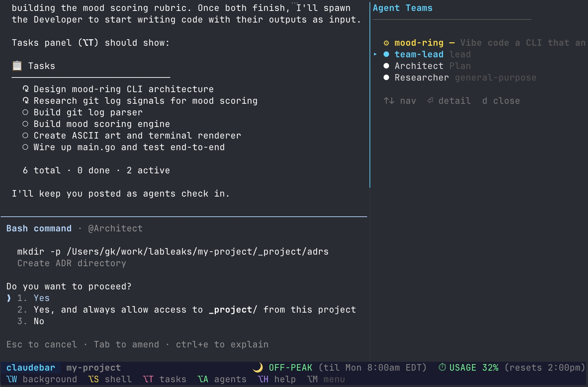
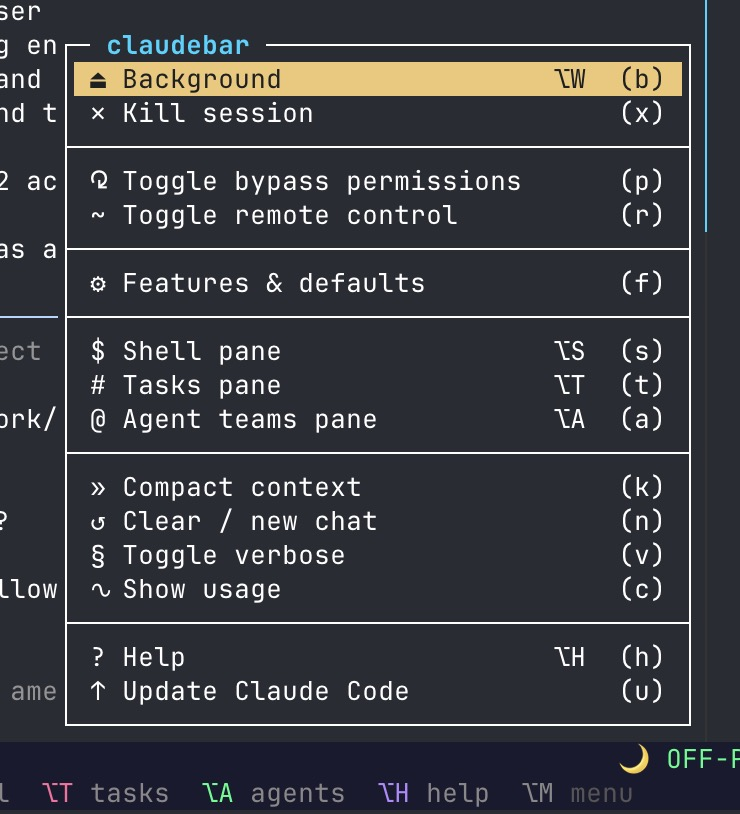
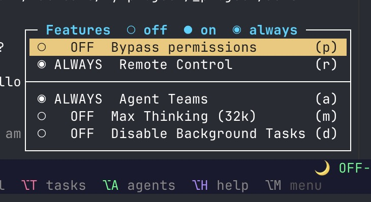

# claudebar

The missing interactive menu bar for [Claude Code](https://claude.ai/code).



## What it does

claudebar wraps Claude Code in a tmux session with a status bar, interactive side panels, and a clickable menu. Everything you'd otherwise do with slash commands or CLI flags, accessible from a persistent UI.

- **Status bar** with peak hours, usage %, and reset countdown — always visible, no `/usage` needed
- **Clickable menu** to toggle bypass permissions, remote control, agent teams, max thinking — restarts with `--resume` automatically
- **Router** — use non-Anthropic models (OpenRouter, etc.) via built-in proxy. Config wizard, per-session token/cost tracking
- **Tasks pane** (`⌥T`) — interactive task viewer and manager alongside Claude
- **Agent teams pane** (`⌥A`) — see your team members, their inboxes, and status
- **Session defaults** — set bypass permissions, agent teams, etc. to ALWAYS so every new session starts the way you want
- **Backgrounding** — `⌥W` to detach, `claudebar` to reattach. Especially useful on remote servers where you SSH in and out

## Install

```bash
# Homebrew
brew install lableaks/tap/claudebar

# Or download the binary
curl -sSfL https://raw.githubusercontent.com/lableaks/claudebar/master/install.sh | sh

# Or build from source (Go 1.26+)
git clone https://github.com/lableaks/claudebar && cd claudebar && make install
```

Requires [tmux](https://github.com/tmux/tmux) (`brew install tmux`).

## Usage

```bash
claudebar                  # Launch or reattach for this directory
claudebar --model sonnet   # Pass any Claude Code flags
claudebar sessions         # Manage sessions across projects
```

 

### Shortcuts

| Key | Action |
|-----|--------|
| `⌥M` | Menu (or click the status bar) |
| `⌥T` | Tasks pane |
| `⌥A` | Agent teams pane |
| `⌥S` | Shell pane |
| `⌥W` | Background session |
| `⌥H` | Help |

### Features menu

Toggle features without restarting manually. Each cycles through:

- `○ OFF` → `● ON` → `◉ ALWAYS` (default for all new sessions)

Bypass permissions, remote control, agent teams, max thinking tokens, and more. Defaults saved to `~/.config/claudebar/config.json`.

## How it works

Dedicated tmux socket (`-L claudebar`), isolated from your other tmux sessions. Feature changes atomically restart Claude with `--resume` — side panes survive, conversation preserved.

## License

MIT
